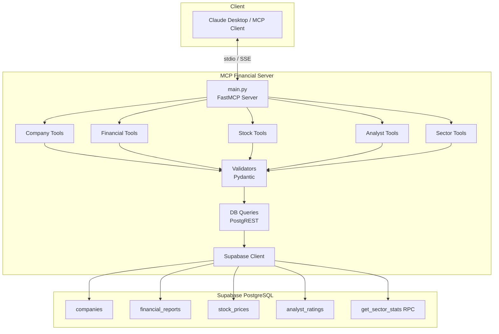

# MCP Financial Server

A Model Context Protocol (MCP) server that exposes 8 financial database tools backed by Supabase PostgreSQL. Designed for use with Claude Desktop, MCP Inspector, or any MCP-compatible client.

## Architecture



## Available Tools

| # | Tool | Description | Input Parameters |
|---|------|-------------|------------------|
| 1 | `get_company_profile` | Fetch full company profile by ticker or name | `identifier` (string) |
| 2 | `search_companies` | Search companies by sector, industry, market cap, or country | `sector?`, `industry?`, `min_market_cap?`, `max_market_cap?`, `country?` |
| 3 | `get_financial_report` | Get quarterly/annual financial reports | `ticker`, `fiscal_year?`, `fiscal_quarter?` (Q1-Q4) |
| 4 | `compare_companies` | Compare 2-5 companies side-by-side | `tickers` (string[]), `metrics?` (string[]) |
| 5 | `get_stock_price_history` | Historical daily stock prices | `ticker`, `start_date?`, `end_date?`, `limit?` (default 30) |
| 6 | `screen_stocks` | Screen stocks by financial criteria | `min_revenue?`, `min_eps?`, `min_gross_margin?`, `max_debt_to_equity?`, `sector?` |
| 7 | `get_analyst_ratings` | Analyst ratings and price targets | `ticker`, `firm?` |
| 8 | `get_sector_overview` | Aggregated sector statistics | `sector` (required) |

## Prerequisites

- **Python 3.11+** (tested with Python 3.14)
- **Supabase project** — database schema must be applied (see Step 3 below)

## Quick Start

### 1. Clone the repository

```bash
git clone <repository-url>
cd mcp-financial-server
```

### 2. Create virtual environment and install dependencies

```bash
python3 -m venv .venv
source .venv/bin/activate    # On macOS/Linux
# .venv\Scripts\activate     # On Windows

pip install -e ".[dev]"
```

### 3. Set up the database

Run the SQL from `database/schema.sql` in the Supabase SQL Editor:
- Go to [Supabase Dashboard](https://supabase.com/dashboard) > your project > **SQL Editor**
- Copy and paste the contents of `database/schema.sql`
- Click **Run**

This creates 4 tables (`companies`, `financial_reports`, `stock_prices`, `analyst_ratings`) and a `get_sector_stats` RPC function.

### 4. Configure environment variables

```bash
cp .env.example .env
```

All values are **pre-filled** in `.env.example` — no edits needed for the default Supabase project.

| Variable | Pre-filled? | Description |
|----------|:-----------:|-------------|
| `SUPABASE_URL` | Yes | Supabase project URL |
| `SUPABASE_KEY` | Yes | Supabase anon key |
| `MCP_TRANSPORT` | Yes | Transport: `stdio` or `sse` (default: `stdio`) |
| `MCP_HOST` | Yes | SSE bind host (default: `0.0.0.0`) |
| `MCP_PORT` | Yes | SSE bind port (default: `8000`) |
| `RATE_LIMIT_RPM` | Yes | Rate limit requests/min (default: `60`) |

### 5. Seed the database

```bash
source .venv/bin/activate   # if not already activated
python database/seed_script.py
```

This inserts 25 companies, 300 financial reports, ~1600 stock prices, and ~60 analyst ratings.

### 6. Run the server

**stdio mode** (for Claude Desktop):
```bash
source .venv/bin/activate
python -m src.main
```

**SSE mode** (for web/remote clients):
```bash
source .venv/bin/activate
python -m src.main --transport sse --port 8000
```

**MCP Inspector** (interactive testing):
```bash
source .venv/bin/activate
mcp dev src/main.py
```

### 7. Claude Desktop configuration

Add to your `claude_desktop_config.json`:

```json
{
  "mcpServers": {
    "financial-server": {
      "command": "/path/to/mcp-financial-server/.venv/bin/python",
      "args": ["-m", "src.main"],
      "cwd": "/path/to/mcp-financial-server",
      "env": {
        "SUPABASE_URL": "https://grgtxcvpqwzxglrbkgro.supabase.co",
        "SUPABASE_KEY": "your-supabase-anon-key"
      }
    }
  }
}
```

## Example Tool Calls

### Get Company Profile
```
Tool: get_company_profile
Args: {"identifier": "AAPL"}
```

### Search Companies
```
Tool: search_companies
Args: {"sector": "Technology", "industry": "Software"}
```

### Financial Report
```
Tool: get_financial_report
Args: {"ticker": "MSFT", "fiscal_year": 2024, "fiscal_quarter": "Q4"}
```

### Compare Companies
```
Tool: compare_companies
Args: {"tickers": ["AAPL", "MSFT", "GOOGL"], "metrics": ["revenue", "eps", "gross_margin"]}
```

### Stock Price History
```
Tool: get_stock_price_history
Args: {"ticker": "NVDA", "start_date": "2024-10-01", "end_date": "2024-12-31"}
```

### Screen Stocks
```
Tool: screen_stocks
Args: {"sector": "Healthcare", "min_gross_margin": 40, "min_eps": 2.0}
```

### Analyst Ratings
```
Tool: get_analyst_ratings
Args: {"ticker": "TSLA", "firm": "Goldman Sachs"}
```

### Sector Overview
```
Tool: get_sector_overview
Args: {"sector": "Energy"}
```

## Running Tests

```bash
source .venv/bin/activate
pytest tests/ -v
```

Tests mock the Supabase client and cover:
- Input validation (ticker format, date format, identifier, quarter strings, metrics)
- Response formatting (currency, percentages, tables, comparison)
- Error handling (company not found, rate limits)
- Rate limiter behavior
- Query functions with mocked DB responses

## Project Structure

```
mcp-financial-server/
├── README.md               <- You are here
├── pyproject.toml           <- Dependencies & project config
├── .env.example             <- Environment variable template (pre-filled)
├── src/
│   ├── main.py              <- FastMCP entry point
│   ├── config/env.py        <- Pydantic Settings
│   ├── db/
│   │   ├── client.py        <- Supabase client singleton
│   │   └── queries.py       <- All DB query functions
│   ├── tools/
│   │   ├── company_tools.py <- get_company_profile, search_companies
│   │   ├── financial_tools.py <- get_financial_report, compare_companies
│   │   ├── stock_tools.py   <- get_stock_price_history, screen_stocks
│   │   ├── analyst_tools.py <- get_analyst_ratings
│   │   └── sector_tools.py  <- get_sector_overview
│   ├── validators/
│   │   └── input_validator.py <- Pydantic input models
│   └── utils/
│       ├── errors.py        <- Custom error classes
│       ├── formatters.py    <- Response text formatting
│       └── rate_limiter.py  <- Sliding-window rate limiter
├── database/
│   ├── schema.sql           <- Table definitions & RPC function
│   ├── seed.sql             <- SQL fallback seed data
│   └── seed_script.py       <- Python seed script
└── tests/
    └── test_tools.py        <- Unit tests with mocked DB
```

## Security

- **No SQL injection**: All queries use the Supabase PostgREST client which automatically parameterizes values
- **Input validation**: Every tool input is validated via Pydantic before querying
- **Rate limiting**: In-memory sliding-window limiter prevents abuse on SSE transport
- **Env separation**: Secrets loaded from `.env` file, never hardcoded

## License

MIT
